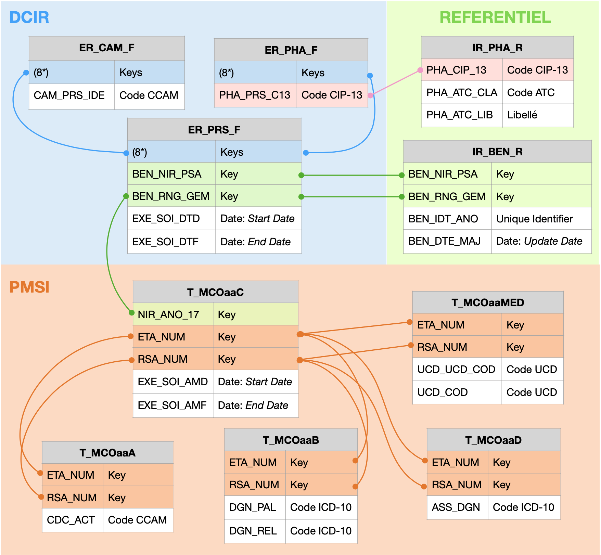
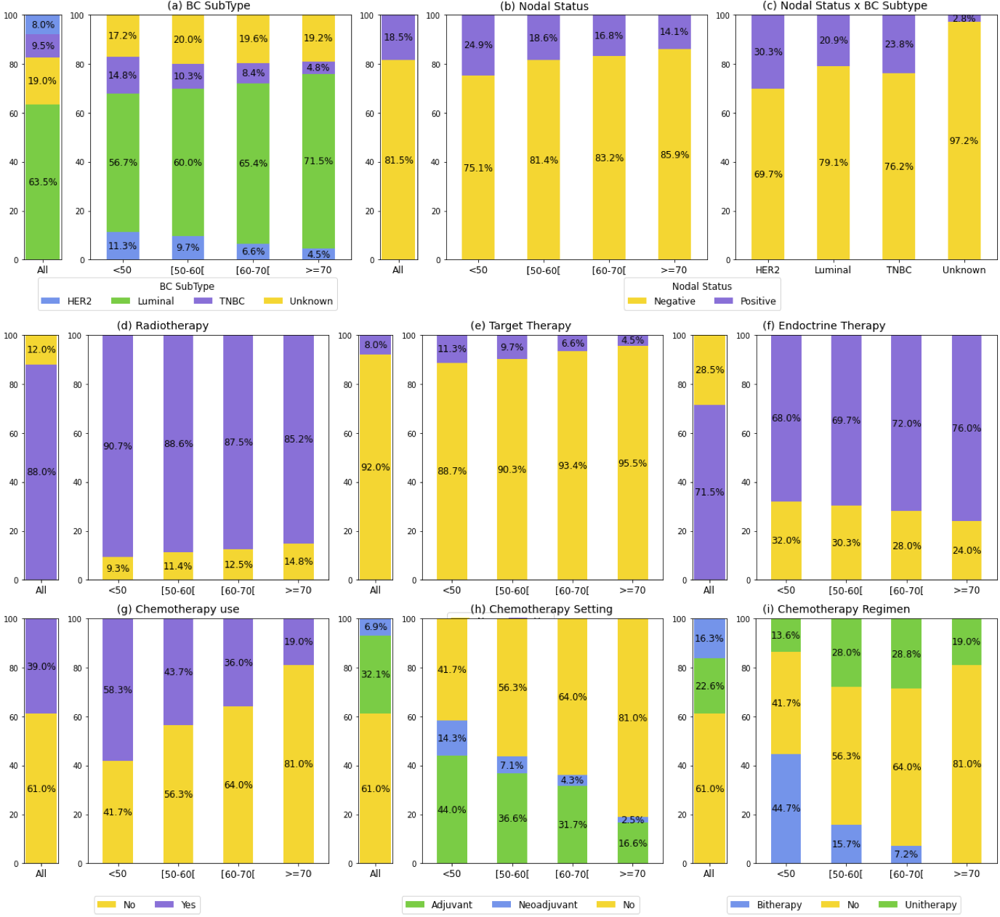

## Statement of need

The French Nationwide Healthcare Database (SNDS), initially created for healthcare reimbursement, contains medical data on approximately 60 million insured patients in France [@tuppin2017value]. It encompasses a broad spectrum of medical concepts represented by standardized codes, including diagnoses (ICD-10 classification), medical procedures (Classification Commune des Actes Médicaux, CCAM), and prescribed treatments (Anatomical Therapeutic Chemical classification, ATC). 

The information contained in the SNDS comes from three sources:

- Health insurance expenditure data (e.g., reimbursements for drugs withdrawn from the pharmacy or for medical procedures) provided by the CNAM (*Système National d'Information InterRégime de l'Assurance Maladie*).
- Information on hospital admissions, reasons for admission, medical procedures, and diagnoses provided by ATIH (*Programme de Médicalisation des Systèmes d'Information*).
- Medical causes of death reported by CépiDc (INSERM).

Therefore, the SNDS has become an essential resource for public health research. It enables large-scale epidemiological studies, analysis of patient care pathways, and prediction of health risks using comprehensive real-world data, thus representing a strategic lever for evaluating and improving health policies.

Several studies have demonstrated the relevance of using SNDS data to investigate the prevalence, incidence, and management of chronic diseases. Notable examples include research on:

- Psoriatic arthritis [@pina2021epidemiologic ; @vegas2022long],
- Dementia [@carcaillon2021prevalence],
- Phenylketonuria [@douillard2023health].

The SNDS also proved particularly useful during the COVID-19 pandemic thanks to near real-time access to data, which eliminated the need for time-consuming and costly post-epidemic surveys [@poucineau2022hospital; @semenzato2021antihypertensive].

Beyond disease analysis, the SNDS offers significant potential for identifying determinants of care trajectories and their economic impact. For instance, studies by [@poulalhon2018use] and [@ossima2023end] on palliative care and end-of-life expenditures highlighted how care pathways significantly influence healthcare costs. These findings underscore the value of medico-administrative data for longitudinal patient monitoring and optimization of care delivery.

Nevertheless, the medical information within the SNDS is distributed across more than **700 interconnected tables** linked through various join variables.

This complexity makes it particularly challenging to retrieve relevant clinical information and accurately define target populations, due to the vast number of medical codes involved, which are often abstract and difficult to interpret. To address these challenges, we propose an open-source package designed to facilitate the identification of patient populations within the SNDS architecture.

---

## Description of the package and its functionalities

The `pysnds` package consists of two main classes:

### SNDS_Query

This class explores the complex architecture of the SNDS database to identify the population of interest and retrieve relevant information for the study. It locates medical codes of interest related to:

- Procedures (CCAM-coded) in both the DCIR and PMSI datasets,
- Established diagnoses (ICD-10-coded) in the PMSI,
- Prescribed treatments encoded in CIP-13 format in the DCIR and in UCD format in the PMSI.

All these functionalities take as input unique patient identifiers, a list of targeted medical codes and an optional period of inclusion.

One specific method, `Get_ID`, retrieves the unique patient identifiers:

- In the DCIR: combination of `BEN_NIR_PSA` and `BEN_RNG_GEM`,
- In the PMSI: `NIR_ANO_17`, linked to `BEN_NIR_PSA` in the DCIR.

This method returns both the updated unique identifier `BEN_IDT_ANO` (ensuring it reflects the latest update date `BEN_DTE_MAJ`) as well as the original identifier pair for completeness.

Once the target population is identified, another method, `Get_AGE`, computes the age at inclusion based on the first occurrence of a relevant medical code.

### SNDS_Treatment

This class inherits from `SNDS_Query`. Given a list of medical codes and optionaly a period of inclusion, it searches the SNDS to determine whether the identified patients have received specific treatments. It also provides the corresponding dates, including the first date of administration.

---

## Use example on Female Breast Cancer Population

We provide a complete and reusable example demonstrating the package functionalities, illustrated through a case study focused on the **female breast cancer population**.

As a starting point, we include a comprehensive dictionary of medical codes relevant to breast cancer treatments, extracted from the FRESH study [@dumas2022french]:

For each treatment type (surgery, chemotherapy, radiotherapy, etc.), the dictionary contains the corresponding medical codes, structured with keys referring to coding systems (`ATC`, `CCAM`, `ICD10`, `UCD`, `CIP13`). This format is supported by the `SNDS_Query` class, which uses the dictionary to identify the relevant SNDS tables.

The class `SNDS_BC`, built on top of the core classes, analyzes the target population. It includes:

- **treatment_setting** – Determines whether a treatment is neoadjuvant (before surgery) or adjuvant (after surgery).
- **Chemotherapy_Regimen** – Identifies the chemotherapy regimen (unitherapy or bitherapy).
- **EndoctrineTherapy_Treatment** – Identifies the endocrine therapy regimen. Seven regimens are defined:
  - Two unitherapies (Aromatase Inhibitor or Tamoxifen),
  - Four bitherapies (e.g., Tamoxifen followed by Aromatase Inhibitor),
  - One undefined ("Unknown") when the regimen cannot be classified.

Based on these functionalities, the `BC_POP_Stat` function characterizes each patient by providing:

- Age at enrollment
- Nodal status of the breast cancer
- Type of surgery: none, partial mastectomy, or mastectomy
- Radiotherapy modality: none / neoadjuvant / adjuvant
- Chemotherapy modality: none / neoadjuvant or adjuvant / unitherapy or bitherapy
- Targeted therapy modality: none / neoadjuvant or adjuvant
- Endocrine therapy modality: none / neoadjuvant or adjuvant / detailed regimen

Additional functions:

- **BC_subtype** – Detects the breast cancer subtype.
- **therapeutic_pathway** – Determines the therapeutic sequence (11 pathways defined).
- **statistical_analyses** – Enables subgroup analyses (e.g., by age or treatment pathway).
- **vizualisation_pop** – Generates plots summarizing population characteristics.

Although tailored to breast cancer, these tools can be adapted to other pathologies by users. A complete example of use of the whole functionalities is provided with the package.

---

## Conclusion and Perspectives

The provided package allows SNDS users to efficiently access relevant medical information within this complex database architecture. Developed in `Python` for compatibility with the Health Data Hub platform, it can also be adapted to `R` to extend its use to the CNAM platform. While the illustrative example focuses on breast cancer, the approach can be readily applied to other pathologies, provided that the corresponding treatment dictionaries are available. Contributions and collaborations are highly encouraged to further enrich the package, enhance its functionalities, and facilitate the exploration of the SNDS.

---

## References

